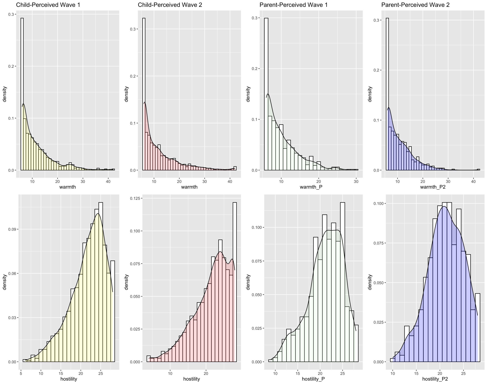
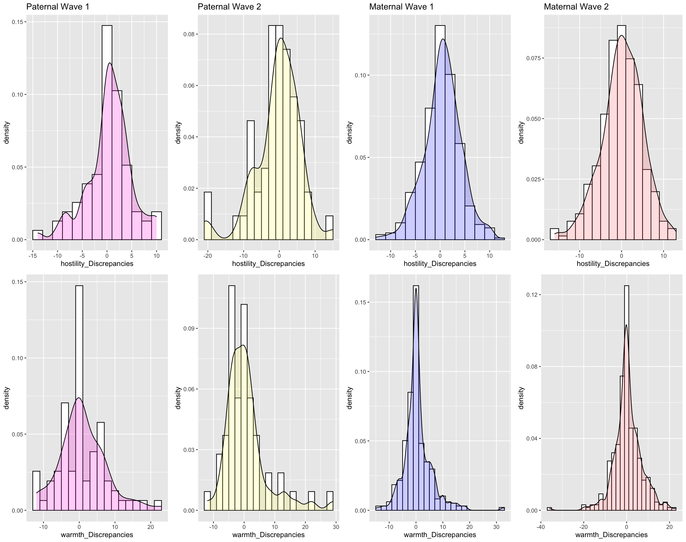
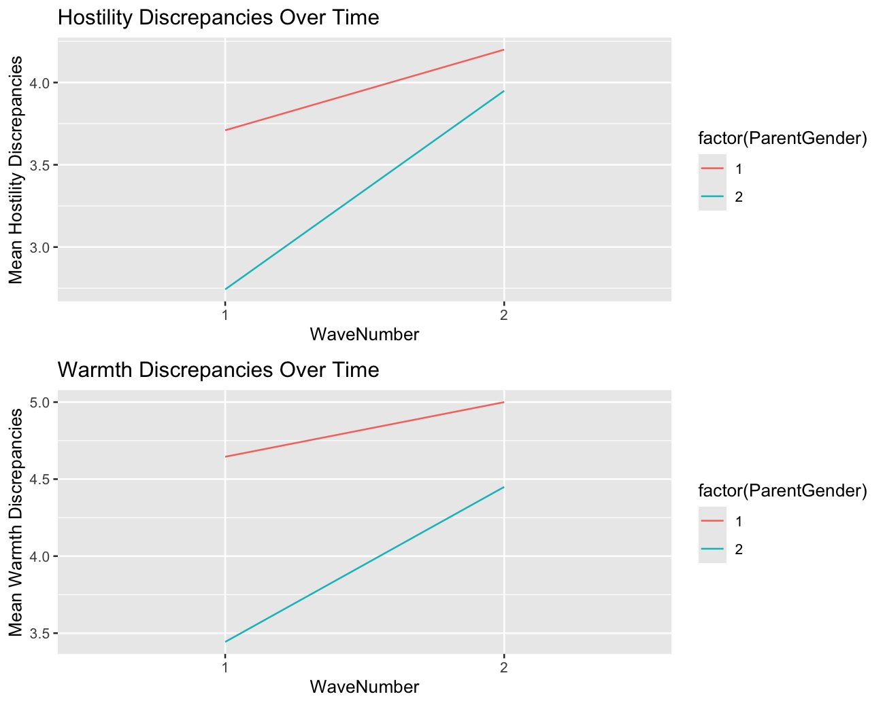
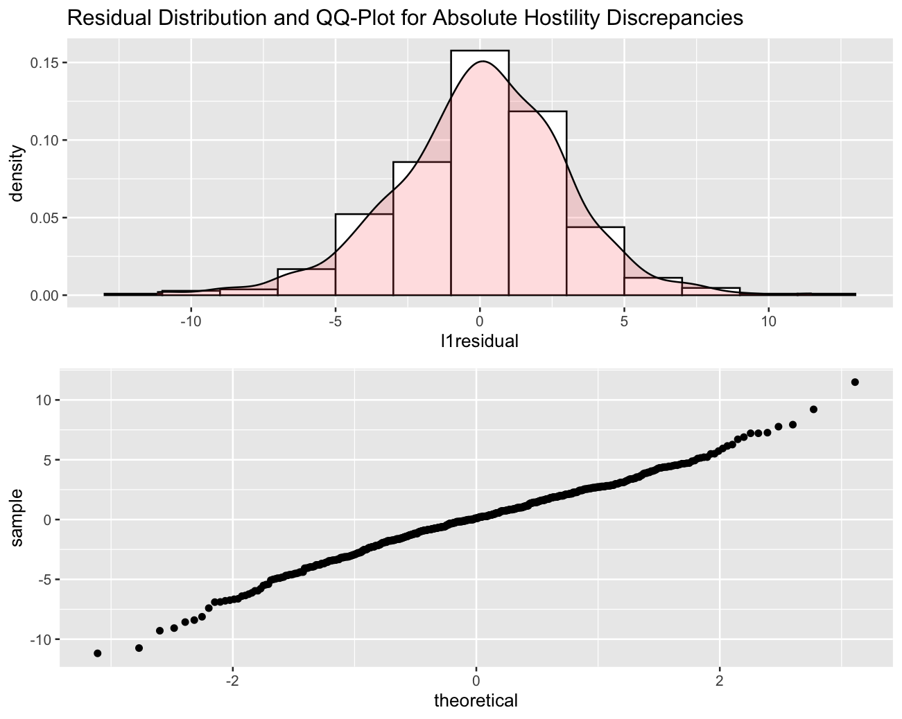
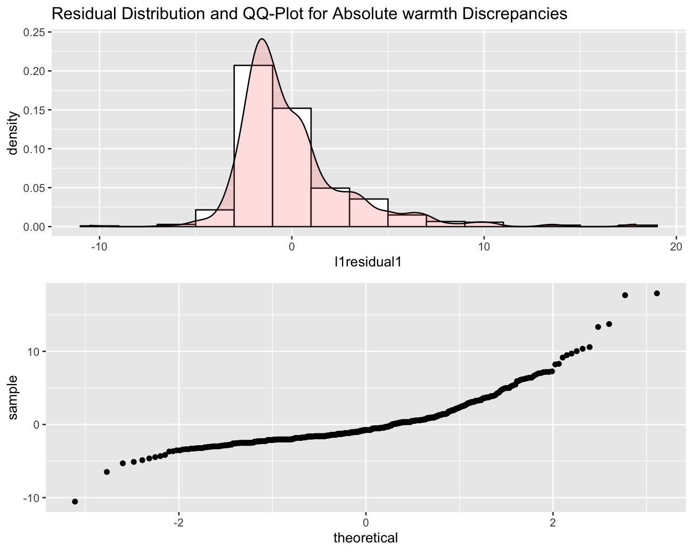
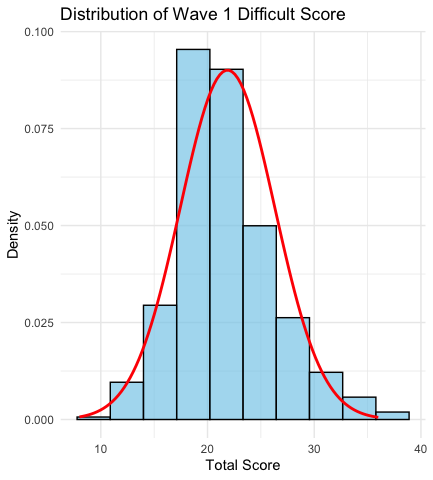
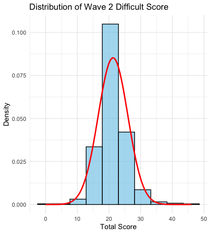

# **Team 6 LDA Project**

> This is the LDA team 6 project by Rowland and Po-Kai. Research suggested that self-control of children declines when making the transition to secondary school, with parental warmth playing a role in the trajectory (Ng-Knight et al., 2016). Recent studies further demonstrated that a higher level of jointly perceived parental warmth is associated with more positive adjustments in adolescents (Gniewosz et al., 2023). We thus aim to understand the underlying trajectory of how parental warmth affects children development. Our analysis focused on the discrepancy score of parental warmth perceived by children and parents with a longitudinal data collected in South-east England, UK from October 2011 to September 2012 (Rice et al, 2017).

## Research Question

**First research question: How do the discrepancies between child-perceived parental warmth & hostility and parent-perceived parental warmth & hostility change from wave 1 to wave 2?**
>Since pupils go through secondary school transition from wave 1 to wave 2, our hypothesis is that the discrepancies will significantly differ due to the stressful event of school transitioning.

**Second research question: Do the discrepancies differ for mothers and fathers?**
>In other words, do moms or dads tend to have higher discrepancy in their parental warmth and hostility? Do moms or dads' discrepancies change more following school transitioning?**


**Third research question: How does parental warmth and hostility discrepancy at wave 1 predict pupil's mental health difficulties at wave 2?**
>According to Buthmann et al. (2023), lower adolescent than parent ratings of parental warmth predicted increased externalizing symptoms after two years follow-up. We are interested in 1. if hostility discrepancy score also serves as good predictor 2. if the results can be replicated in predicting mental health difficulties.

## Data Preparation
```{r}
library(haven)
schooltransitiondata <- read_sav("/Users/rluo/Documents/Longitudinal Data Analysis/Team-6/Data/SchoolTransitionData.sav")
```

*Remember that lower scores means a higher extent---lower scores of warmth means more warmth and lower scores of hostility means more hostility*

```{r}
library(tidyverse)
PWHdata <- schooltransitiondata %>%
  select(76:97, ID) %>%
  filter(!is.na(C1_PWHAa)) %>%
  filter(C1_PWHAa == 0 | C1_PWHBa == 0)
```

*All of the children are living with either their mom or dad or both during the past 6 months.*

I first look at child-perceived parental warmth and hostility at wave 1

```{r}
MaternalPWHdata <- PWHdata %>%
  select(1:11, ID) %>%
  na.omit %>%
  mutate(hostility = C1_PWHA1 + C1_PWHA3 + C1_PWHA4 + C1_PWHA8) %>%
  mutate(warmth = C1_PWHA2 + C1_PWHA5 + C1_PWHA6 + C1_PWHA7 + C1_PWHA9 + C1_PWHA10)
PaternalPWHdata <- PWHdata %>%
  select(12:22, ID) %>%
  na.omit %>%
  mutate(hostility = C1_PWHB1 + C1_PWHB3 + C1_PWHB4 + C1_PWHB8) %>%
  mutate(warmth = C1_PWHB2 + C1_PWHB5 + C1_PWHB6 +C1_PWH7 + C1_PWHB9 +C1_PWHB10)
Maternal <- MaternalPWHdata %>%
  select(warmth, hostility, ID)
Paternal <- PaternalPWHdata %>%
  select(warmth, hostility, ID)
```

*I filtered out all the rows with NA data*

```{r}
Overall <- rbind(Maternal, Paternal)
p1 <- ggplot(Overall, aes(x = warmth)) +
  geom_histogram(aes(y = ..density..),
                 binwidth = 1,
                 colour = "black", fill = "white")+
  geom_density(alpha = .2, fill="#FF6")+
  ggtitle("Child-Perceived Parental Warmth at Wave 1")
p2 <- ggplot(Overall, aes(x = hostility)) +
  geom_histogram(aes(y = ..density..),
                 binwidth = 1,
                 colour = "black", fill = "white")+
  geom_density(alpha = .2, fill="#FF6666")+
  ggtitle("Child-perceived Parental Hostility at Wave 1")
library(gridExtra)
p_density <- grid.arrange(p1, p2)
```

Now I look at parent-perceived parental warmth and hostility at wave 1

```{r}
PWHdata_parents <- schooltransitiondata %>%
  select(418:427, ID) %>%
  na.omit
Parent_PWHdata<- PWHdata_parents %>%
  mutate(hostility_P = P1_PWH1 + P1_PWH3 + P1_PWH4 + P1_PWH8) %>%
  mutate(warmth_P = P1_PWH2 + P1_PWH5 + P1_PWH6 + P1_PWH7 + P1_PWH9 + P1_PWH10)
p3 <- ggplot(Parent_PWHdata, aes(x = warmth_P)) +
  geom_histogram(aes(y = ..density..),
                 binwidth = 1,
                 colour = "black", fill = "white")+
  geom_density(alpha = .2, fill="#dfd")+
  ggtitle("Parent-Perceived Parental Warmth at Wave 1")
p4 <- ggplot(Parent_PWHdata, aes(x = hostility_P)) +
  geom_histogram(aes(y = ..density..),
                 binwidth = 1,
                 colour = "black", fill = "white")+
  geom_density(alpha = .2, fill="#F2D") +
  ggtitle("Parent-Perceived Parental Hostility at Wave 1")
p_density2 <- grid.arrange(p3, p4)
```

*Figure 1. Distribution of children&parent-perceived warmth and hostility score wave 1&2*


Now I look at discrepancies (children - parents)

*First of all, I will merge the parent- and children-perceived PWH data together based on ID.*
```{r}
Parent_PWHdata_overall <- Parent_PWHdata %>%
  select(ID, hostility_P, warmth_P)
Parent_PWHdata<- PWHdata_parents %>%
  mutate(hostility_P = P1_PWH1 + P1_PWH3 + P1_PWH4 + P1_PWH8) %>%
  mutate(warmth_P = P1_PWH2 + P1_PWH5 + P1_PWH6 + P1_PWH7 + P1_PWH9 + P1_PWH10)
Overall_P_and_C <- merge(Overall, Parent_PWHdata, by = "ID")
Overall_P_and_C %>%
  group_by(ID) %>%
  count()
```

*We need to know who wrote the parent-perceived parental warmth and hostility questionnaire (male =1, female =2)*

```{r}
PWHdata_parents <- schooltransitiondata %>%
  select(418:427,251, ID) %>%
  na.omit
Parent_PWHdata<- PWHdata_parents %>%
  mutate(hostility_P = P1_PWH1 + P1_PWH3 + P1_PWH4 + P1_PWH8) %>%
  mutate(warmth_P = P1_PWH2 + P1_PWH5 + P1_PWH6 + P1_PWH7 + P1_PWH9 + P1_PWH10)
Parent_PWHdata_overall <- Parent_PWHdata %>%
  select(ID, hostility_P, warmth_P, P1_ParentGender)
Overall_P_and_C <- merge(Overall, Parent_PWHdata_overall, by = "ID")
```

*Now we need to separate maternal and paternal warmth and hostility*

```{r}
PaternalPupils <- Overall_P_and_C %>%
  filter(P1_ParentGender == 1) %>%
  select(ID) %>%
  unique() %>%
  as.list()
```

*These pupils had their dad filled out the questionnaire, so we should focus on paternal warmth and hostility for these pupils.*

*Let's first check if all the above IDs are in PaternalPWH data IDs*

```{r}
PaternalPupils %in% PaternalPWHdata$ID
```

*So no, not all children with their dad answering the questionnaire had their paternal PWH data. So now we need to filter out those who had their paternal PWH data*

```{r}
list <- as.list(PaternalPWHdata$ID)
commonlist <- as.list(intersect(unlist(PaternalPupils), unlist(list)))
newdata_childperceived <- PaternalPWHdata %>%
  filter(ID %in% commonlist) %>%
  select(ID, hostility, warmth)
newdata_childperceived
```

*This is the list of child-perceived parental warmth that can be compared with father-perceived parental warmth.*

```{r}
Father_PWHdata_overall <- Parent_PWHdata_overall %>%
  filter(P1_ParentGender == 1)
```

*This is the list of parent-perceived parental warmth (dad). Now we check if all IDs in the first list is exactly the same as the IDs in the second list*

```{r}
newdata_childperceived$ID %in% Father_PWHdata_overall$ID
```

*Yes, all the IDs in this new child-perceived dataframe is in father-perceived PWH dataframe*

```{r}
PaternalDataset1 <- merge(newdata_childperceived, Father_PWHdata_overall) %>%
  as_tibble
PaternalDataset1 <- PaternalDataset1 %>%
  rename( hostility_C1 = hostility,
        warmth_C1 = warmth,
        hostility_P1 = hostility_P,
        warmth_P1 = warmth_P)
PaternalDataset1 <- PaternalDataset1 %>%
  select(ID, hostility_C1, warmth_C1, hostility_P1, warmth_P1) %>%
  mutate (hostility_Discrepancies = hostility_C1 - hostility_P1) %>%
  mutate(warmth_Discrepancies = warmth_C1 - warmth_P1)
```

Now we explore the distribution of the paternal discrepancies of warmth and hostility.

```{r}
p5 <- ggplot(PaternalDataset1, aes(x = hostility_Discrepancies)) +
  geom_histogram(aes(y = ..density..),
                 binwidth = 2,
                 colour = "black", fill = "white")+
  geom_density(alpha = .2, fill="#FF6")+
  ggtitle("Paternal Hostility Discrepancy at Wave 1")
p6 <- ggplot(PaternalDataset1, aes(x = warmth_Discrepancies)) +
  geom_histogram(aes(y = ..density..),
                 binwidth = 2,
                 colour = "black", fill = "white")+
  geom_density(alpha = .2, fill="#FF6666")+
  ggtitle("Paternal Warmth Discrepancy at Wave 1")
p_density3 <- grid.arrange(p5, p6)
```

**We shall pause and do some interpretations here: Lower number means more: for example, a lower number of warmth means that there is MORE warmth in the parental relationship; similarly, a high number of hostility means that there is LESS hostility in the parental relationship. So if the hostility discrepancy is a large positive number, it means that the child has a higher perceived hostility score, meaning that the child thinks that the parent is being LESS hostile than the parents think they are. On the other hand, if the hostility discrepancy is a large negative number, it means that the child has a lower perceived hostility score, meaning that the child thinks that the parent is being MORE hostile than the parents thinks they are. In similar senses, a large positive warmth discrepancy number means that the child has a higher perceived warmth score, meaning that the child thinks that the parent is being LESS warm than the parents think they are. A large negative warmth discrepancy number means that the child has a lower perceived warmth score, meaning that the child thinks that the parent is being MORE warm than the parents think they are.**

**We can observe from the distribution shape that hostility discrepancy is left skewed while warmth discrepancy is right skewed. And this means that parents generally tend to think they are more hostile and less warm than the children think they are. This could be a demonstration of parental guilt---parents sometime tend to over-reflect on their parental behaviors. Note that this is only the paternal data though. The next step is to see if similar patterns show on maternal data.**

Now let's look at the discrepancy for maternal data.

```{r}
MaternalPupils <- Parent_PWHdata_overall %>%
  filter(P1_ParentGender == 2) %>%
  select(ID) %>%
  unique() %>%
  as.list()
list1 <- as.list(MaternalPWHdata$ID)
commonlist1 <- as.list(intersect(unlist(MaternalPupils), unlist(list1)))
newdata_childperceived_m <- MaternalPWHdata %>%
  filter(ID %in% commonlist1) %>%
  select(ID, hostility, warmth)
Mother_PWHdata_overall <- Parent_PWHdata_overall %>%
  filter(P1_ParentGender == 2)
newdata_childperceived_m$ID %in% Mother_PWHdata_overall$ID
```

*We have much more maternal data than paternal data; more mothers filled out the parental warmth forms than the fathers.*

```{r}
MaternalDataset1 <- merge(newdata_childperceived_m, Mother_PWHdata_overall) %>%
  as_tibble
MaternalDataset1 <- MaternalDataset1 %>%
  rename( hostility_C1 = hostility,
          warmth_C1 = warmth,
          hostility_P1 = hostility_P,
          warmth_P1 = warmth_P)
MaternalDataset1 <- MaternalDataset1 %>%
  select(ID, hostility_C1, warmth_C1, hostility_P1, warmth_P1) %>%
  mutate (hostility_Discrepancies = hostility_C1 - hostility_P1) %>%
  mutate(warmth_Discrepancies = warmth_C1 - warmth_P1)
p7 <- ggplot(MaternalDataset1, aes(x = hostility_Discrepancies)) +
  geom_histogram(aes(y = ..density..),
                 binwidth = 2,
                 colour = "black", fill = "white")+
  geom_density(alpha = .2, fill="#0000FF7D")+
  ggtitle("Maternal Hostility Discrepancy at Wave 1")
p8 <- ggplot(MaternalDataset1, aes(x = warmth_Discrepancies)) +
  geom_histogram(aes(y = ..density..),
                 binwidth = 2,
                 colour = "black", fill = "white")+
  geom_density(alpha = .2, fill="#d2d")+
  ggtitle("Maternal Warmth Discrepancy at Wave 1")
p_density4 <- grid.arrange(p7, p8)
p_overall_1 <- grid.arrange(p5, p7, p6, p8, nrow = 2, ncol = 2)
```

**We can see that the patterns for paternal and maternal data are actually quite similar. I would say that the hostility discrepancy resembles more of a normal distribution and the warmth discrepancy data has a larger and more prominent peak. This could potentially mean that mothers are more accurate in terms of their self-reflected parental warmth and hostility (at least more consistent with children's feedback). The degree of "parental guilt" as described before is less prominent among mothers than fathers.**

Okay, now we can do the same thing for the Wave 2 data.

```{r}
PWHdataWave2 <- schooltransitiondata %>%
  select(553:574, ID) %>%
  filter(!is.na(C2_PWHAa)) %>%
  filter(!is.na(C2_PWHBa)) %>%
  filter(C2_PWHAa == 0 | C2_PWHBa == 0) %>%
  na.omit
MaternalPWHdataWave2 <- PWHdataWave2 %>%
  select(1:11, ID) %>%
  mutate(hostility = C2_PWHA1 + C2_PWHA3 + C2_PWHA4 + C2_PWHA8) %>%
  mutate(warmth = C2_PWHA2 + C2_PWHA5 + C2_PWHA6 + C2_PWHA7 + C2_PWHA9 + C2_PWHA10)
PaternalPWHdataWave2 <- PWHdataWave2 %>%
  select(12:22, ID) %>%
  mutate(hostility = C2_PWHB1 + C2_PWHB3 + C2_PWHB4 + C2_PWHB8) %>%
  mutate(warmth = C2_PWHB2 + C2_PWHB5 + C2_PWHB6 +C2_PWHB7 + C2_PWHB9 +C2_PWHB10)
MaternalWave2 <- MaternalPWHdataWave2 %>%
  select(warmth, hostility, ID)
PaternalWave2 <- PaternalPWHdataWave2 %>%
  select(warmth, hostility, ID)
OverallWave2 <- rbind(MaternalWave2, PaternalWave2)
p9 <- ggplot(OverallWave2, aes(x = warmth)) +
  geom_histogram(aes(y = ..density..),
                 binwidth = 1,
                 colour = "black", fill = "white")+
  geom_density(alpha = .2, fill="#d2d") +
  ggtitle("Child-Perceived Parental Warmth at Wave 2")
p10 <- ggplot(OverallWave2, aes(x = hostility)) +
  geom_histogram(aes(y = ..density..),
                 binwidth = 1,
                 colour = "black", fill = "white")+
  geom_density(alpha = .2, fill="#DFD")+
  ggtitle("Child-Perceived Parental Hostility at Wave 2")
grid.arrange(p9, p10)
grid.arrange(p1, p9, p2, p10, nrow = 2, ncol = 2)
```

**From here we can see that the child-perceived parental warmth and hostility are actually very similar for wave 1 and wave 2. One difference that is worth noting is that for wave 2 hostility data, there is a huge peak at the very right, which means that parental hostility actually goes down at wave 3. This makes sense because if we look at the far-left peak at wave 2 for warmth, it is actually higher than that in Wave 2. Generally, parents are warmer and less hostile toward their children at wave 2.**

```{r}
PWHdata_parents_Wave2 <- schooltransitiondata %>%
  select(732:741, ID, P2_ParentGender) %>%
  na.omit
Parent_PWHdata_Wave2<- PWHdata_parents_Wave2 %>%
  mutate(hostility_P2 = P2_PWH1 + P2_PWH3 + P2_PWH4 + P2_PWH8) %>%
  mutate(warmth_P2 = P2_PWH2 + P2_PWH5 + P2_PWH6 + P2_PWH7 + P2_PWH9 + P2_PWH10)
p11 <- ggplot(Parent_PWHdata_Wave2, aes(x = warmth_P2)) +
  geom_histogram(aes(y = ..density..),
                 binwidth = 1,
                 colour = "black", fill = "white")+
  geom_density(alpha = .2, fill="#0000FF7D")+
  ggtitle("Parent-Perceived Parental Warmth at Wave 2")
p12 <- ggplot(Parent_PWHdata_Wave2, aes(x = hostility_P2)) +
  geom_histogram(aes(y = ..density..),
                 binwidth = 1,
                 colour = "black", fill = "white")+
  geom_density(alpha = .2, fill="#FF6") +
  ggtitle("Parent-Perceived Parental Hostility at Wave 2")
grid.arrange(p11, p12)
grid.arrange(p3, p11, p4, p12)
grid.arrange(p1, p9, p3, p11, p2, p10, p4, p12, nrow = 2, ncol = 4)
```

**From this graph, we can see that the discrepancy between wave 2 hostility child-perceived and parent-perceived is the greatest. We shall know more about it once we conducted discrepancy analyses.**

Now we can calculate the discrepancies at Wave 2.

*Again, we need to know who wrote the questionnaire at wave 2 (mom or dad).*

```{r}
PaternalPupilsWave2 <- Parent_PWHdata_Wave2 %>%
  filter(P2_ParentGender == 1) %>%
  select(ID) %>%
  unique() %>%
  as.list()
```

*This is the list of pupils that have their dad filled out the PWH data at wave 2.*

```{r}
PaternalPupilsWave2 %in% PaternalPWHdataWave2$ID
list2 <- as.list(PaternalPWHdataWave2$ID)
commonlist2 <- as.list(intersect(unlist(PaternalPupilsWave2), unlist(list2)))
newdata_childperceived_p_wave2 <- PaternalPWHdataWave2 %>%
  filter(ID %in% commonlist2) %>%
  select(ID, hostility, warmth)
Father_PWHdata_overall_wave2 <- Parent_PWHdata_Wave2 %>%
  filter(P2_ParentGender == 1) %>%
  select(ID, hostility_P2, warmth_P2)
newdata_childperceived_p_wave2$ID %in% Father_PWHdata_overall_wave2$ID
```

*Now we combine the child-perceived and dad-perceived data together.*

```{r}
PaternalDataset2 <- merge(newdata_childperceived_p_wave2, Father_PWHdata_overall_wave2) %>%
  as_tibble
PaternalDataset2 <- PaternalDataset2 %>%
  rename(hostility_C2 = hostility,
         warmth_C2 = warmth) 
PaternalDataset2 <- PaternalDataset2 %>%
  mutate(hostility_Discrepancies = hostility_C2 - hostility_P2,
         warmth_Discrepancies = warmth_C2 - warmth_P2)
p13 <- ggplot(PaternalDataset2, aes(x = hostility_Discrepancies)) +
  geom_histogram(aes(y = ..density..),
                 binwidth = 2,
                 colour = "black", fill = "white")+
  geom_density(alpha = .2, fill="#FF6")+
  ggtitle("Paternal Hostility Discrepancy at Wave 2")
p14 <- ggplot(PaternalDataset2, aes(x = warmth_Discrepancies)) +
  geom_histogram(aes(y = ..density..),
                 binwidth = 2,
                 colour = "black", fill = "white")+
  geom_density(alpha = .2, fill="#FF6666")+
  ggtitle("Paternal Warmth Discrepancy at Wave 2")
grid.arrange(p13, p14)

```

**If the hostility discrepancy is a large positive number, it means that the child has a higher perceived hostility score, meaning that the child thinks that the parent is being LESS hostile than the parents think they are. On the other hand, if the hostility discrepancy is a large negative number, it means that the child has a lower perceived hostility score, meaning that the child thinks that the parent is being MORE hostile than the parents thinks they are. In similar senses, a large positive warmth discrepancy number means that the child has a higher perceived warmth score, meaning that the child thinks that the parent is being LESS warm than the parents think they are. A large negative warmth discrepancy number means that the child has a lower perceived warmth score, meaning that the child thinks that the parent is being MORE warm than the parents think they are.**

**We can observe from the distribution shape that hostility discrepancy is left skewed while warmth discrepancy is right skewed. And this means that parents generally tend to think they are more hostile and less warm than the children think they are. This could be a demonstration of parental guilt---parents sometime tend to over-reflect on their parental behaviors. Note that this is only the paternal data though. The next step is to see if similar patterns show on maternal data. Basically the same patterns maintained at wave 2. We shall compare the distribution side by side to have a better comparison.**

But we shall look at maternal data first.

```{r}
MaternalPupilsWave2 <- Parent_PWHdata_Wave2 %>%
  filter(P2_ParentGender == 2) %>%
  select(ID) %>%
  unique() %>%
  as.list()
MaternalPupilsWave2 %in% MaternalPWHdataWave2$ID
list3 <- as.list(MaternalPWHdataWave2$ID)
commonlist3 <- as.list(intersect(unlist(MaternalPupilsWave2), unlist(list3)))
newdata_childperceived_m_wave2 <- MaternalPWHdataWave2 %>%
  filter(ID %in% commonlist3) %>%
  select(ID, hostility, warmth)
Mother_PWHdata_overall_wave2 <- Parent_PWHdata_Wave2 %>%
  filter(P2_ParentGender == 2) %>%
  select(ID, hostility_P2, warmth_P2)
newdata_childperceived_m_wave2$ID %in% Mother_PWHdata_overall_wave2$ID
MaternalDataset2 <- merge(newdata_childperceived_m_wave2, Mother_PWHdata_overall_wave2) %>%
  as_tibble
MaternalDataset2 <- MaternalDataset2 %>%
  rename(hostility_C2 = hostility,
         warmth_C2 = warmth) 
MaternalDataset2 <- MaternalDataset2 %>%
  mutate(hostility_Discrepancies = hostility_C2 - hostility_P2,
         warmth_Discrepancies = warmth_C2 - warmth_P2)
p15 <- ggplot(MaternalDataset2, aes(x = hostility_Discrepancies)) +
  geom_histogram(aes(y = ..density..),
                 binwidth = 2,
                 colour = "black", fill = "white")+
  geom_density(alpha = .2, fill="#0000FF7D")+
  ggtitle("Maternal Hostility Discrepancy at Wave 2")
p16 <- ggplot(MaternalDataset2, aes(x = warmth_Discrepancies)) +
  geom_histogram(aes(y = ..density..),
                 binwidth = 2,
                 colour = "black", fill = "white")+
  geom_density(alpha = .2, fill="#d2d") +
  ggtitle("Maternal Warmth Discrepancy at Wave 2")
grid.arrange(p15, p16)
```

**Again, maternal discrepancies distributions are less skewed than that of paternal ones. There is an apparent outlier in the warmth discrepancy data though which is worth noting. Now we can put wave 2 discrepancy data together.**

```{r}
grid.arrange(p13, p15, p14, p16, nrow = 2, ncol = 2)
```

```{r}
grid.arrange(p5, p13, p7, p15, p6, p14, p8, p16, nrow = 2, ncol = 4)
```


*Figure 2. Distribution of paternal&maternal discrepency scores wave 1&2*


*Let's look at the paternal dataset first to see how many people dropped out after first wave.*

```{r}
PaternalDataset2$ID %in% PaternalDataset1$ID
PaternalDataset1 <- PaternalDataset1 %>%
  mutate(ParentGender = "Male",
         WaveNumber = "Wave1")
PaternalDataset2 <- PaternalDataset2 %>%
  mutate(ParentGender = "Male",
         WaveNumber = "Wave2")
PaternalDataOverall <- bind_rows(PaternalDataset1, PaternalDataset2)
PaternalDataOverall %>%
  group_by(ID) %>%
  count()
```

*And then let's look at maternal dataset*

```{r}
MaternalDataset2$ID %in% MaternalDataset1$ID
MaternalDataset1 <- MaternalDataset1 %>%
  mutate(ParentGender = "Female",
         WaveNumber = "Wave1")
MaternalDataset2 <- MaternalDataset2 %>%
  mutate(ParentGender = "Female",
         WaveNumber = "Wave2")
MaternalDataOverall <- bind_rows(MaternalDataset1, MaternalDataset2)
MaternalDataOverall %>%
  group_by(ID) %>%
  count() 
```

*Now we combine the maternal AND paternal data into a big dataframe*

```{r}
OverallData <- bind_rows(PaternalDataOverall, MaternalDataOverall) %>%
  as_tibble
```

**Now I feel like it would make more sense to treat the discrepancy as absolute value. If I have more time, I think it would be even better to treat the positive value and negative value of discrepancy separately.**

```{r}
OverallData <- OverallData %>%
  mutate(Abs_hostility_Discrepancies = abs(hostility_Discrepancies),
         Abs_warmth_Discrepancies = abs(warmth_Discrepancies))
```

## Multilevel Modeling
>So what I am doing is called a Mixed model ANOVA. This model is specifically used for 2 dichotomous independent variables, which is the case here.

```{r}
library(lme4)
DataLoss <- OverallData %>%
  group_by(ID) %>%
  count()
DataLoss <- DataLoss %>%
  filter(n == 2)
OverallDataComplete <- OverallData %>%
  filter(ID %in% DataLoss$ID)
OverallDataComplete <- OverallDataComplete %>%
  mutate(ParentGender = factor(ParentGender, levels = c("Male", "Female")),
         WaveNumber = factor(WaveNumber, levels = c("Wave1", "Wave2")))
OverallDataComplete <- OverallDataComplete %>%
  mutate(WaveNumber= as.numeric(WaveNumber),
         ParentGender = as.numeric(ParentGender))
```

*This generates a new dataset that include all individuals that have completed surveys in both wave 1 and wave 2*

Null model

```{r}
null_model1 <- lmer(Abs_hostility_Discrepancies ~ 1 + (1|ID), data = OverallDataComplete, REML = FALSE)
summary(null_model1)
library(performance)
performance::icc(null_model1)
```

**ICC is interpreted as the proportion of variance between people. 18.6% of the variance in hostility discrepancy is attributed to a person.**

Adding level-1 and Level-2 fixed and random effects

```{r}
l1_model <- lmer(Abs_hostility_Discrepancies ~ 1 + WaveNumber + ParentGender + (1|ID), data = OverallDataComplete, REML = FALSE)
l1_model_wo_ParentGender <- lmer(Abs_hostility_Discrepancies ~ 1 + WaveNumber + (1|ID), data = OverallDataComplete, REML = FALSE)
summary(l1_model)
summary(l1_model_wo_ParentGender)
anova(l1_model, l1_model_wo_ParentGender)
anova(null_model1, l1_model)
anova(null_model1, l1_model_wo_ParentGender)
```

**Intercept is 2.77, meaning that at wave 0 when the parent gender is male, the average hostility discrepancy across all individuals is 2.77. But we don't have a wave 0, so this value is non-interpretable. Wave 2 has a 1.12 higher hostility discrepancy than wave 1 and dad has 0.74 higher hostility discrepancy on average.**

**Note that adding parent gender or not into the predictor did not significantly influence the deviance of the model, meaning that parent gender is likely a very weak predictor.**

**The model has significantly less deviance, so it is a better model.**

```{r}
library(lmerTest)
coef(summary(l1_model <- lmer(Abs_hostility_Discrepancies ~ 1 + WaveNumber + ParentGender + (1|ID), data = OverallDataComplete, REML = FALSE)))
```

Adding random slope. Note that I did not add parent gender into this model since it is a insignificant predictor.

```{r}
l1_random <- lmer(Abs_hostility_Discrepancies ~ 1 + WaveNumber + (0 + WaveNumber|ID) + (1|ID), data = OverallDataComplete, REML = FALSE)
summary(l1_random)
```

*Singularity problem: 1|ID is very close to zero, meaning that the individual differences are very low. This indicates that the same individual tends to have very similar discrepancies between wave 1 and wave 2. So I removed the 1|ID element that explains the random effects of individuals.*

```{r}
l1_random <- lmer(Abs_hostility_Discrepancies ~ 1 + WaveNumber + (0 + WaveNumber|ID), data = OverallDataComplete, REML = FALSE)
summary(l1_random)
anova(l1_model_wo_ParentGender, l1_random)
```

**Adding the random slope can decrease the deviance of the model, thus a good model.**

Adding interaction terms.

```{r}
crosslevel_model <- lmer(Abs_hostility_Discrepancies ~ 1 + WaveNumber + ParentGender + (0 + WaveNumber|ID) + WaveNumber:ParentGender, data = OverallDataComplete, REML = FALSE)
summary(crosslevel_model)
```

**Note that after adding the interaction term, the main effects of wave number and parent gender became insignificant. I will explain it with visualization later on. The Interaction is insignificant.**

Let's now look at parental warmths.

Null Model

```{r}
null_model2 <- lmer(Abs_warmth_Discrepancies ~ 1 + (1|ID), data = OverallDataComplete, REML = FALSE)
summary(null_model2)
performance::icc(null_model1)
```

**ICC is interpreted as the proportion of variance between people. 18.6% of the variance in hostility discrepancy is attributed to a person.**

Adding level 1 and level 2 fixed and random effects

```{r}
l1_model1 <- lmer(Abs_warmth_Discrepancies ~ 1 + WaveNumber + ParentGender + (1|ID), data = OverallDataComplete, REML = FALSE)
summary(l1_model1)
```

*Parent Gender's effect was less significant than hostility discrepancy. Now let's remove parent gender and then compare.*

```{r}
l1_model1_wo_ParentGender <- lmer(Abs_warmth_Discrepancies ~ 1 + WaveNumber + (1|ID), data = OverallDataComplete, REML = FALSE)
summary(l1_model1_wo_ParentGender)
anova(l1_model1, l1_model1_wo_ParentGender)
```

*Again, parent gender is a weak predictor. Now we add random slopes.*

```{r}
l1_random1 <- lmer(Abs_warmth_Discrepancies ~ 1 + WaveNumber + (0 + WaveNumber|ID) + (1|ID), data = OverallDataComplete, REML = FALSE)
summary(l1_random1)
l1_random1 <- lmer(Abs_warmth_Discrepancies ~ 1 + WaveNumber + (0 + WaveNumber|ID), data = OverallDataComplete, REML = FALSE)
summary(l1_random1)
anova(l1_random1, l1_model1_wo_ParentGender)
```

*The deviance is way lower for the model that include the random slope. Now let's include interaction.*

```{r}
crosslevel_model1 <- lmer(Abs_warmth_Discrepancies ~ 1 + WaveNumber + ParentGender + (0 + WaveNumber|ID) + WaveNumber:ParentGender, data = OverallDataComplete, REML = FALSE)
summary(crosslevel_model1)
```

**Similarly, after adding the interaction term, the main effects of wave number of parent gender became insignificant.**

**In summary, from wave 1 to wave 2, the hostility discrepancy increased by 1.13. ALthough not significant (tendency to significance), moms tend to have 0.74 less discrepancy than dads. From wave 1 to wave 2, the warmth discrepancy increased by 0.93. Although not significant, moms have 0.85 less discrepancy than dads. Hostility discrepancy seems to have a more parent gender-based effect than warmth discrepancy. This could indicates that stressful events such as transitioning to secondary school can increase the discrepancy between parent-perceived and child-perceived parental warmth and hostility.**

I am now trying to visualize the data.

```{r}
p17 <- OverallDataComplete %>%
  group_by(WaveNumber, ParentGender) %>%
  mutate(hmean = mean(Abs_hostility_Discrepancies)) %>%
  ggplot(mapping = aes(x = WaveNumber, y = hmean, colour = factor(ParentGender) )) +
  geom_line() +
  labs(title = "Hostility Discrepancies Over Time", y = "Mean Hostility Discrepancies") +
  scale_x_discrete(limits = c(1, 2))
```
  
```{r, echo = FALSE}
plot(p17)
```

**We can see here that major difference between wave 1 and wave 2 is contributed by mom. That is exactly why after adding interaction terms the main effects of wave number and parent gender became insignificant.**

```{r}
p18 <- OverallDataComplete %>%
  group_by(WaveNumber, ParentGender) %>%
  mutate(wmean = mean(Abs_warmth_Discrepancies)) %>%
  ggplot(mapping = aes(x = WaveNumber, y = wmean, colour = factor(ParentGender) )) +
  geom_line() +
  labs(title = "Warmth Discrepancies Over Time", y = "Mean Warmth Discrepancies") +
  scale_x_discrete(limits = c(1, 2))
```

```{r, echo=FALSE}
plot(p18)
```

**We can see here that major difference between wave 1 and wave 2 is again contributed by mom. That is exactly why after adding interaction terms the main effects of wave number and parent gender became insignificant.**

```{r}
grid.arrange(p17, p18)
```


*Figure 3. Warmth and hostility discrepancies over time*

**In summary, we can conclude that warmth and hostility discrepancies for moms seem to increase more drastically from wave 1 to wave 2. Dads tend to have an overall higher warmth and hostility discrepancies than mom.**

I need to check the residual and homoscedacity.

```{r}
l1residual <- residuals(l1_random)
head(l1residual)
```

*After extracting the residuals, I have to make sure that the residuals are normally distributed.*

```{r}
p19 <- ggplot(OverallDataComplete, aes(x = l1residual)) +
  geom_histogram(aes(y = ..density..),
                 binwidth = 2,
                 colour = "black", fill = "white")+
  geom_density(alpha = .2, fill="#FF6666") +
  ggtitle("Residual Distribution and QQ-Plot for Absolute Hostility Discrepancies")
```

```{r, echo=FALSE}
plot(p19)
```

*Great, residuals is normally distributed. Let's just double-check with qq-plot.*

```{r}
p20 <- OverallDataComplete %>%
  ggplot(mapping = aes(sample = l1residual)) +
  stat_qq()
```

```{r, echo=FALSE}
plot(p20)
```

```{r}
grid.arrange(p19, p20)
```


*Figure 4. Residual distribution and QQ-plot for absolute hostility discrepancies*

**Checked. The qq plot is linear, meaning that the residuals are roughly normally distributed. This is only for hostility Discrepancies.**

```{r}
l1residual1 <- residuals(l1_random1)
head(l1residual1)
p21 <- ggplot(OverallDataComplete, aes(x = l1residual1)) +
  geom_histogram(aes(y = ..density..),
                 binwidth = 2,
                 colour = "black", fill = "white")+
  geom_density(alpha = .2, fill="#FF6666") +
  ggtitle("Residual Distribution for Absolute warmth Discrepancies")
```

```{r, echo=FALSE}
plot(p21)
```

*Okay, there are perhaps some outliers in this residual distribution. I will conduct a qq plot to make sure.*

```{r}
p22 <- OverallDataComplete %>%
  ggplot(mapping = aes(sample = l1residual1)) +
  stat_qq() +
  ggtitle("qq Plot for Absolute Warmth Discrepancies")
```

```{r, echo=FALSE}
plot(p22)
```

```{r}
grid.arrange(p21, p22)
```


*Figure 5. Residual distribution and QQ-plot for absolute warmth discrepancies*

**So the residuals for this one is close to normally distributed but I am not sure. So this indicates that maybe more predictors need to be addded. The shape means the is slightly skewed and a bit heavy on tails.**

# Regression Analysis

```{r}
children_difficult_wave1 <- schooltransitiondata %>% select(1, 98:122)
children_difficult_wave1_filtered <- children_difficult_wave1 %>% filter(complete.cases(.))
children_difficult_wave1_filtered_sum <- children_difficult_wave1_filtered %>% 
  rowwise() %>%
  mutate(total_score_wave1 = sum(c_across(2:26), na.rm = TRUE)) %>%
  ungroup()

children_difficult_wave2 <- schooltransitiondata %>% select(1, 575:599)
children_difficult_wave2_filtered <- children_difficult_wave2 %>% filter(complete.cases(.))
children_difficult_wave2_filtered_sum <- children_difficult_wave2_filtered %>% 
  rowwise() %>%
  mutate(total_score_wave2 = sum(c_across(2:26), na.rm = TRUE)) %>%
  ungroup()

children_difficult_merge <- merge(children_difficult_wave1_filtered_sum, children_difficult_wave2_filtered_sum, by = "ID", all = FALSE)
```

*Let's check the difficult score distribution a bit*

```{r}
ggplot(children_difficult_merge, aes(x = total_score_wave1)) +
  geom_histogram(aes(y = ..density..), bins = 10, fill = "skyblue", color = "black", alpha = 0.7) +
  stat_function(fun = dnorm, args = list(mean = mean(children_difficult_merge$total_score_wave1, na.rm = TRUE), 
                                        sd = sd(children_difficult_merge$total_score_wave1, na.rm = TRUE)),
                color = "red", size = 1) +
  labs(title = "Distribution of Wave 1 Difficult Score", x = "Total Score", y = "Density") +
  theme_minimal()

ggplot(children_difficult_merge, aes(x = total_score_wave2)) +
  geom_histogram(aes(y = ..density..), bins = 10, fill = "skyblue", color = "black", alpha = 0.7) +
  stat_function(fun = dnorm, args = list(mean = mean(children_difficult_merge$total_score_wave2, na.rm = TRUE), 
                                        sd = sd(children_difficult_merge$total_score_wave2, na.rm = TRUE)),
                color = "red", size = 1) +
  labs(title = "Distribution of Wave 2 Difficult Score", x = "Total Score", y = "Density") +
  theme_minimal()
```




*Figure 6 & Figure7. Distribution of difficulty scores wave1&2*

>The sum of difficulty scores seems to be normally distributed.

*We proceed to set up regression model for predicting difficult scores reported by children in wave 2*

```{r}
discrepancy_score <- rbind(MaternalDataset1, PaternalDataset1)
regression_dataframe <- merge(children_difficult_merge, discrepancy_score, by = "ID", all = FALSE)

library(lavaan)

model_warmth <- '
total_score_wave2 ~ warmth_Discrepancies + total_score_wave1
'
fit_warmth <- sem(model_warmth, data = regression_dataframe)
summary(fit_warmth)
cor.test(regression_dataframe$warmth_Discrepancies, regression_dataframe$total_score_wave1)

model_hostility <- '
total_score_wave2 ~ hostility_Discrepancies + total_score_wave1
'
fit_hostility <- sem(model_hostility, data = regression_dataframe)
summary(fit_hostility)
cor.test(regression_dataframe$hostility_Discrepancies, regression_dataframe$total_score_wave1)
```

**In the regression model of warmth discrepency predicting difficult scores reported by children, we find the p value = .273; in the regression model of hostility discrepency, we find the p value = .679, both are not significant. Correlation test showed no significance between wave1 difficult score reported by children and warmth discrepancy scores, but showed significance with hostility discrepancy scores (p = .01)**

# Testing Parent Reported Difficult Score

```{r}
parent_difficult_wave1 <- schooltransitiondata %>% select(1, 303:327)
parent_difficult_wave1_filtered <- parent_difficult_wave1 %>% filter(complete.cases(.))
parent_difficult_wave1_filtered_sum <- parent_difficult_wave1_filtered %>% 
  rowwise() %>%
  mutate(total_score_wave1 = sum(c_across(2:26), na.rm = TRUE)) %>%
  ungroup()

parent_difficult_wave2 <- schooltransitiondata %>% select(1, 663:687)
parent_difficult_wave2_filtered <- parent_difficult_wave2 %>% filter(complete.cases(.))
parent_difficult_wave2_filtered_sum <- parent_difficult_wave2_filtered %>% 
  rowwise() %>%
  mutate(total_score_wave2 = sum(c_across(2:26), na.rm = TRUE)) %>%
  ungroup()

parent_difficult_merge <- merge(parent_difficult_wave1_filtered_sum, parent_difficult_wave2_filtered_sum, by = "ID", all = FALSE)
regression_dataframe_parent <- merge(parent_difficult_merge, discrepancy_score, by = "ID", all = FALSE)

fit_warmth_parent <- sem(model_warmth, data = regression_dataframe_parent)
summary(fit_warmth_parent)
cor.test(regression_dataframe_parent$warmth_Discrepancies, regression_dataframe_parent$total_score_wave1)

fit_hostility_parent <- sem(model_hostility, data = regression_dataframe_parent)
summary(fit_hostility_parent)
cor.test(regression_dataframe_parent$hostility_Discrepancies, regression_dataframe_parent$total_score_wave1)
```

**In the regression model of warmth discrepency predicting difficult score reported by parents, we find the p value = .489; in the regression model of hostility discrepency, we find the p value = .176, both are not significant. Correlation test showed no significance between wave1 difficult score reported by parents and discrepancy scores.**
